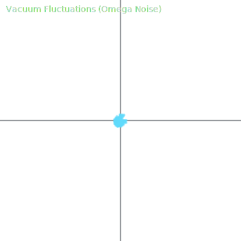
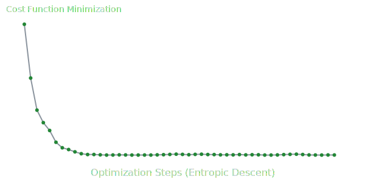

# QubitSim

### Unified Physics Quantum Simulator



[](https://developer.mozilla.org/en-US/docs/Web/JavaScript)
[](https://react.dev/)
[](./src/core/unified_physics.js)
[](./coverage/lcov-report/index.html)
[](LICENSE)

---

## Project Overview

**QubitSim** is a simulation library that bridges classical quantum computing algorithms with the principles of **Unified Physics**. Unlike standard simulators, QubitSim integrates Entropic Vacuum Fluctuations and Holographic Information Density, governed by the emergent constant **Omega (117.038)**.

This platform allows researchers and developers to:

1. Study standard algorithms (Shor, Grover) under realistic entropic noise.
2. Visualize the interaction between qubit states and the vacuum substrate.
3. Simulate "New Physics" decoherence models.


*Figure: Entropic Optimizer convergence path minimizing a cost function under holographic constraints.*

---

## Key Features

### Unified Physics Core

The simulation engine (`src/core/unified_physics.js`) introduces:

- **Entropic Noise**: Qubits interact with vacuum fluctuations derived from Omega.
- **Holographic Optimization**: Gradient descent modified by entropic density.
- **Emergent Gravity**: Simulation of entropic forces at microscopic scales.

### Quantum Algorithms

Full implementations of:

- **Shor's Algorithm**: Integer factorization.
- **Grover's Algorithm**: Unstructured search.
- **Bernstein-Vazirani**: Hidden string finding.
- **Deutsch-Jozsa**: Oracle function analysis.

### Cryptography

- **BB84 Protocol**: Quantum Key Distribution simulation.
- **One-Time Pad**: Quantum-safe message encryption.

---

## Getting Started

### Prerequisites


### Installation

```bash
git clone https://github.com/your-repo/qubitsim.git
npm install
```

### Running the Interface

The project includes a React-based visualization interface.

```bash
npm run dev
```

### Testing

We maintain rigorous testing standards locally.

```bash
npm run test:coverage
```

---

## Architecture

| Module | Description |
| :--- | :--- |
| **Core** | `Qubit`, `QuantumRegister`, and `UnifiedPhysics` logic. |
| **Algorithms** | High-level implementations of quantum logic flows. |
| **Interface** | React components for real-time state visualization. |

---

## License

This project is licensed under the MIT License.
